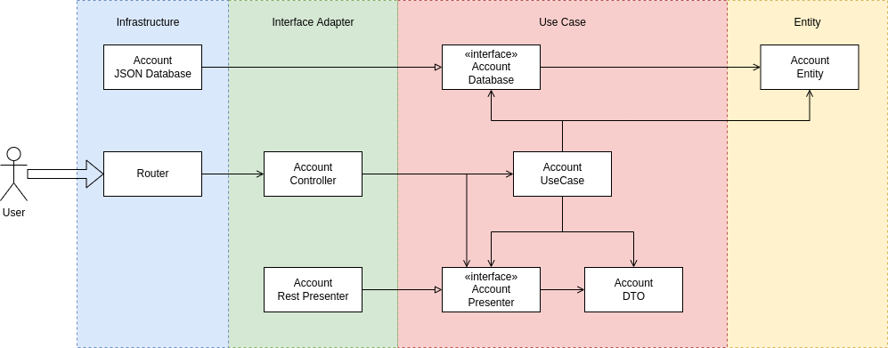

# Architecture

Take a look at [Architecture Thoughts](./architecture-thoughts.md)

:warning: Should I have implemented all those levels of abstraction and indirection?

Certainly not, in this simple application most of them is overengineering, but I'm making it to learn and see the benefits and the problems.

In real world application, it always depends on the complexity and where we want to be protected against changes.

## Responsabilities and Control Flow example

### Responsabilities
`router`
* Receive user request
* Validate user request
* Reply user request

`database`
* Persist data

`controller`
* Parse request body to actual `use case` arguments

`presenter`
* Map `use case` results to a response body

`use case`
* Perform business rules

`entity`
* Business objects

### Dependencies

### Control Flow example

Using `POST /accounts` as example, we'll go step by step to explain what each part of system do

* Server starts by instantiating and "injecting" (for now manually) dependencies like `database` implementations to `usecase` 
* User make request to `POST /accounts`
* `router` validate the input by checking if request body contains `login` and `password` field
* `router` instantiate the `presenter` and call `controller` passing it as argument
  * `controller` parses the request body and passes it in a convenient way to the `use case`
    * `use case` creates an `account entity` based on the arguments
    * `use case` saves the entity by calling through an interface the `database` implementation
      * `database` maps the `entity` into a convenient model and saves it
    * `use case` returns the `entity` data as an DTO by also calling through an interface the `presenter` implementation
      * `presenter` maps the DTO to a convenient output structure
  * `controller` basically errors what the `use case` returns
* `router` get `presenter` data
* `router` answer user request

## Decisions

* `router` performs the error handling in a centralized manner
* `router` performs request validation by using a middleware
* `use case` does not implements an `input port` interface -> we're not likely to change it
* `router` access `presenter` struct data - [view thoughts](./architecture-thoughts.md#22-04-2022-router-accessing-presenter-struct-values)
* `controller` knows about `presenter interface` - [view thoughts](./architecture-thoughts.md#22-04-2022-controller-knowing-about-presenter-interface-expected-by-use-case)